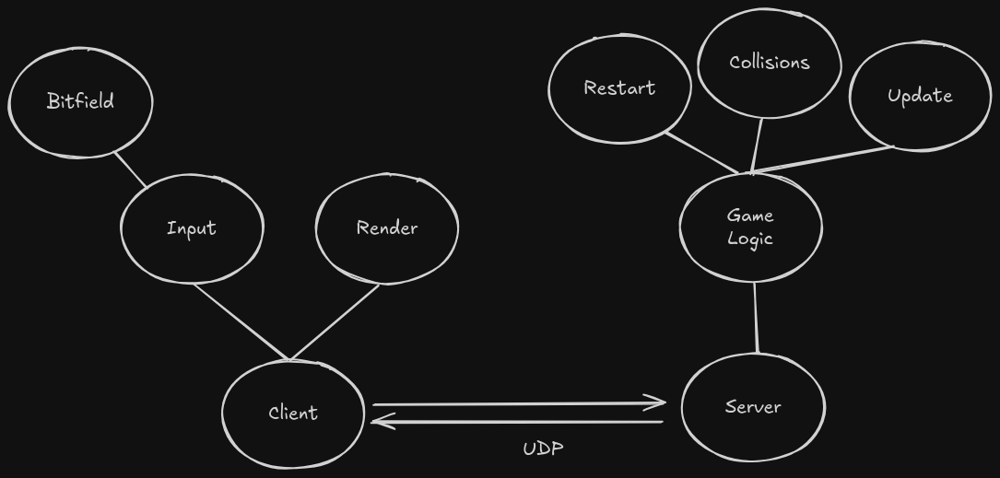

# Gun fight

Made in C, using Raylib, based on Gun Fight (1975)

### Compile Singleplayer:
gcc src/main.c src/audio.c src/game_settings.c src/game_logic.c src/entities.c src/input.c src/render.c -o main -lraylib -lm

### Run Singleplayer:
./main

### Compile Online mode:
gcc src/server.c src/input.c src/entities.c src/game_logic.c src/audio.c src/game_settings.c -o server -lraylib -lm
gcc src/client.c src/input.c src/entities.c src/game_logic.c src/audio.c src/game_settings.c src/render.c -o client -lraylib -lm

### Run Online mode:
./client
./server

### Code Architecture:

